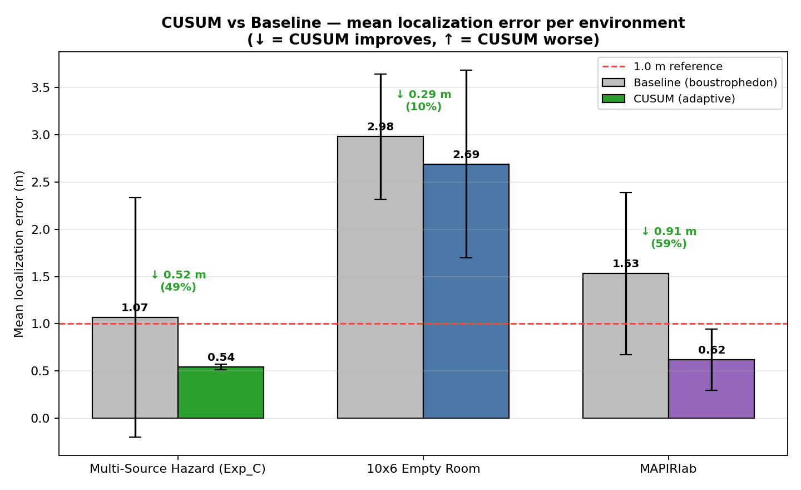
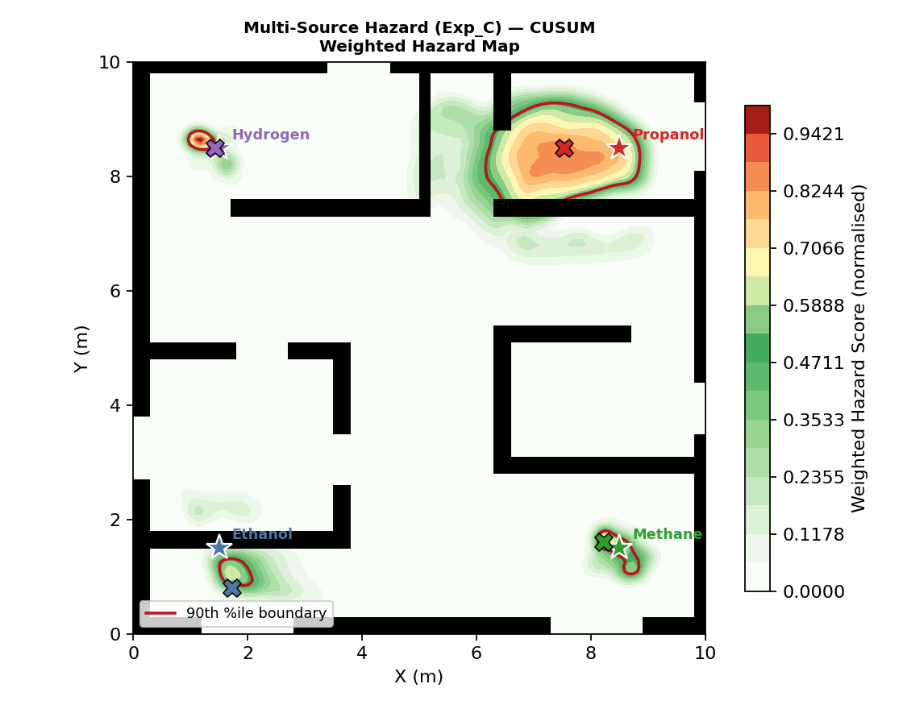
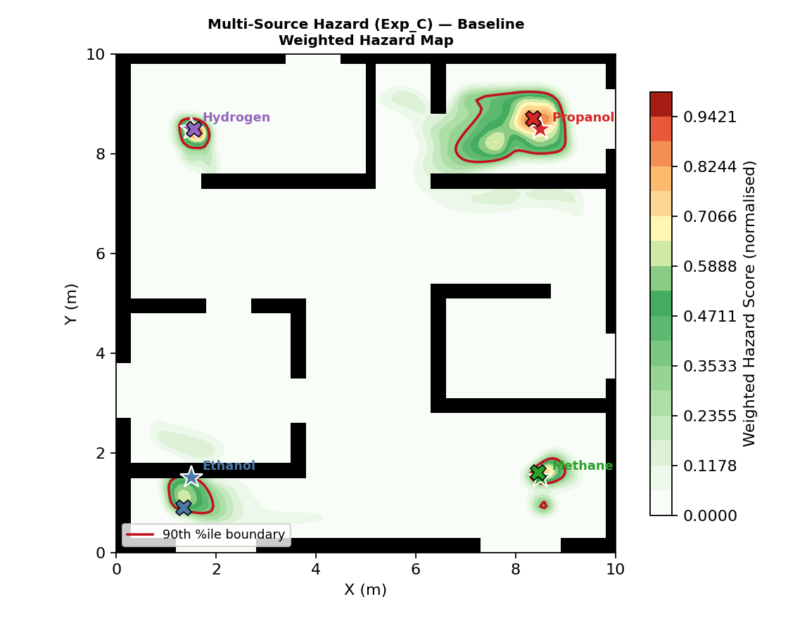
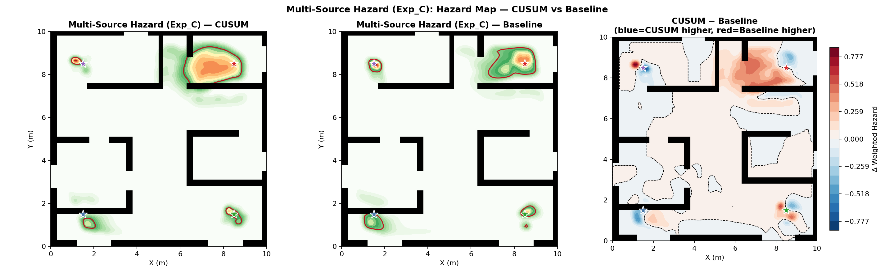
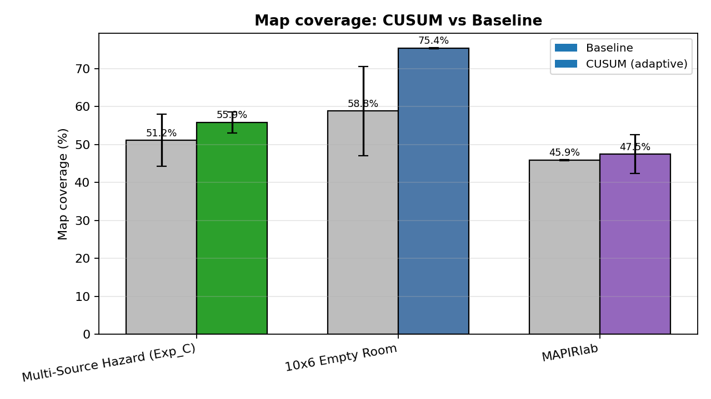

# Auto-Coverage and Gas Source Localization Benchmarking

**Disclaimer:** This repository contains only the core logic files and results for the adaptive auto-coverage mapping algorithm. It is designed to be executed within the [GADEN Simulation Environment](https://github.com/MAPIRlab/gaden.git).

## Setup Instructions

To run these scripts, you will need the main GADEN repository.

1. Clone the [GADEN](https://github.com/MAPIRlab/gaden.git) repository into your ROS 2 workspace:
   ```bash
   cd ~/ros2_ws/src
   git clone https://github.com/MAPIRlab/gaden.git
   ```
2. Copy the Python scripts from this repository (`auto_coverage_mapper.py`, `concentration_mapper.py`, `gas_viz.py`, `plot_from_npz.py`, `coverage_mapper_baseline.py`) into the `gaden/test_env/scripts/` folder.
3. Build the `test_env` package:
   ```bash
   cd ~/ros2_ws
   colcon build --packages-select test_env
   source install/setup.bash
   ```

## Core Logic Files

The essential logic and algorithms are implemented in the following core files:

- **`auto_coverage_mapper.py`**: The primary ROS 2 node that drives the autonomous coverage robot. It employs an adaptive, CUSUM-based hotspot detection logic, shifting the robot from a fast, coarse boustrophedon sweep into reactive, fine-resolution local sweeps whenever gas hotspots are detected. It automatically captures sensor readings and builds a spatial dataset of the gas field.
- **`concentration_mapper.py`**: A standalone ROS 2 node that records real-time gas sensor readings along the robot's trajectory. It interpolates these readings into comprehensive visual maps (concentration heatmaps, contour maps, gradient maps) and performs Bayesian source localization.
- **`gas_viz.py`**: A shared, ROS-independent library handling all offline data analysis and plotting. It implements a physically-grounded Bayesian probabilistic source localization (1/r inversion), which outputs `P(source | readings)` regions instead of just single coordinate points. It generates rich visualizations, highlighting 50% and 90% highest-posterior-density areas.
- **`plot_from_npz.py`**: A utility script to perform offline data re-processing. It can load saved `run_data.npz` files from prior mapper missions, re-compute the Bayesian source localizations using updated models, and regenerate the entire suite of analytical plots.

---

## Running the GADEN Process

The GADEN environment requires four primary stages to execute the coverage benchmark end-to-end. Replace `SCEN` with your target scenario (e.g., `Exp_C`, `10x6_empty_room`, `MAPIRlab`).

### Stage 1: Preprocessing
Generate 3D/2D occupancy and wind grids from CAD models:
```bash
ros2 launch test_env gaden_preproc_launch.py scenario:=SCEN configuration:=config1
```

### Stage 2: Filament Simulation
Simulate gas dispersion. Run this once per source (e.g., `sim1`, `sim2`):
```bash
ros2 launch test_env gaden_sim_launch.py scenario:=SCEN configuration:=config1 simulation:=sim1
```

### Stage 3: Robot and Sensors (Simulation Player)
Launch the robot, Nav2 stack, simulated gas/wind sensors, and playback the GADEN simulation:
```bash
ros2 launch test_env main_simbot_launch.py \
  scenario:=SCEN configuration:=config1 simulation:=sim1 \
  namespace:=PioneerP3DX num_sensors:=2
```

### Stage 4: Run the Auto-Coverage Mapper
In a new sourced terminal, launch the adaptive coverage script from the GADEN repo:
```bash
python3 ~/ros2_ws/src/gaden/test_env/scripts/auto_coverage_mapper.py \
  --ros-args -p generate_plots:=true \
  -p scenario_path:=$HOME/ros2_ws/install/test_env/share/test_env/scenarios/SCEN/environment_configurations/config1
```
The robot will execute its sweeping strategy automatically. Upon completion (or manual Ctrl-C), results and figures will be saved to `~/gaden_results/auto_coverage/<timestamp>/`.

---

## Full Ablation Analysis and Results

The core CUSUM-based adaptive approach was benchmarked against a non-reactive baseline (coarse lawnmower sweep only).

### Localization Error Improvement
Across tested scenarios, the CUSUM-based adaptive localization significantly reduced estimation errors:
- **Multi-Source Hazard (Exp_C)**: 1.07m (Baseline) -> 0.54m (CUSUM) | **49% Improvement**
- **MAPIRlab**: 1.53m (Baseline) -> 0.62m (CUSUM) | **59% Improvement**
- **10x6 Empty Room**: 2.98m (Baseline) -> 2.69m (CUSUM) | **10% Improvement**



### Multi-Source Hazard Map Comparison (Exp_C Scenario)

The differences in spatial awareness are shown in the hazard maps. Blue in the difference map indicates where CUSUM estimates higher hazard (sharper, denser map near the true source). Red means Baseline estimates higher (gas spread more diffusely).

**CUSUM Hazard Map**


**Baseline Hazard Map**


**Difference Map (CUSUM - Baseline)**


**Key Finding on Hazard Maps:**
The CUSUM mapper produces a sharper, more source-centric hazard field because the reactive fine sweeps concentrate samples directly near the true sources. In the `Exp_C` environment, CUSUM estimates higher hazard in 11.0% of the map (concentrated near sources), validating the effectiveness of the targeted hotspot detection.

### Map Coverage
Because the CUSUM approach inserts additional fine-sweep waypoints upon detecting gas hotspots, it directly improved the overall map coverage:
- **Exp_C**: CUSUM 55.9% vs Baseline 51.2% (+4.7%)
- **Empty Room**: CUSUM 75.4% vs Baseline 58.8% (+16.6%)


