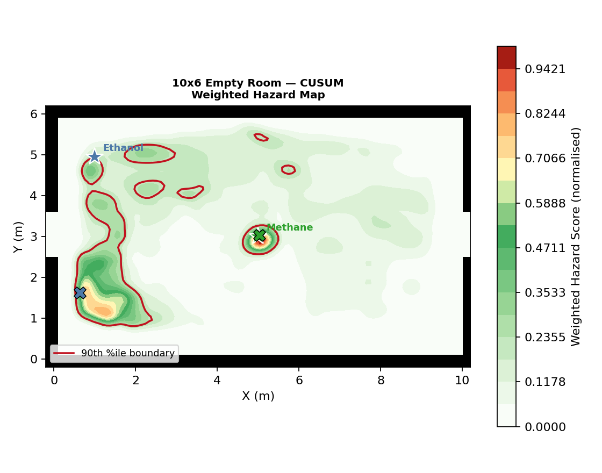
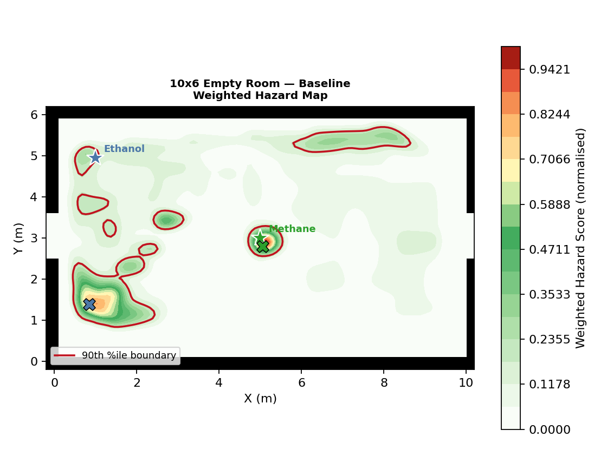
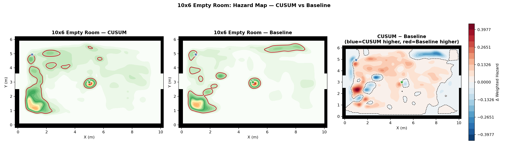
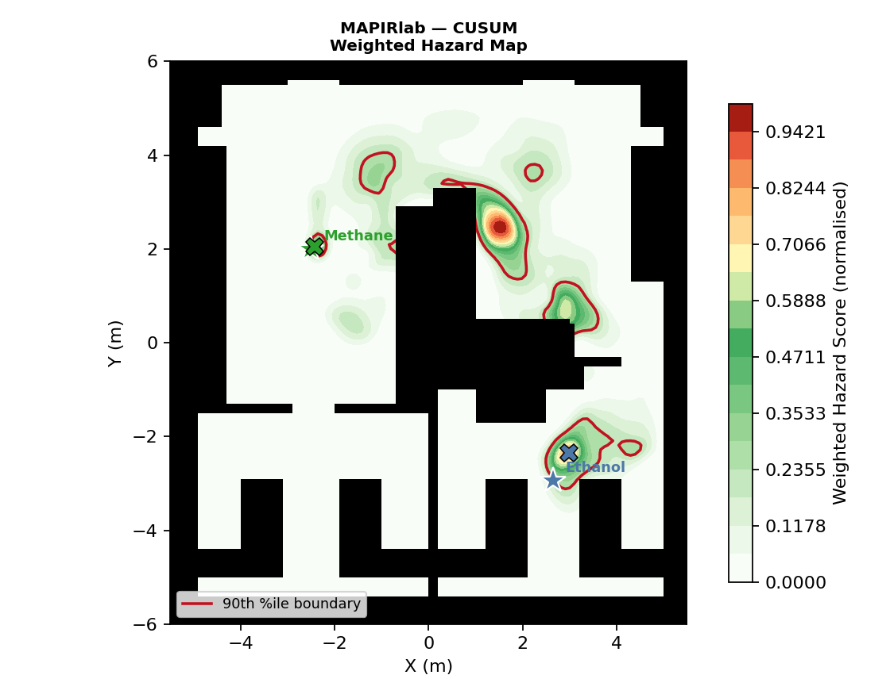
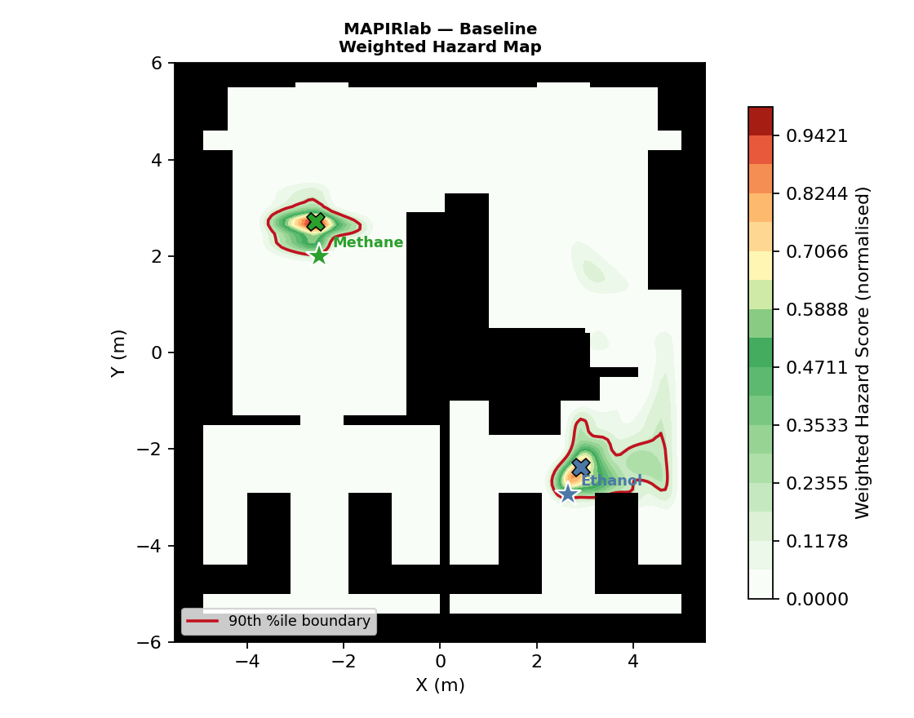
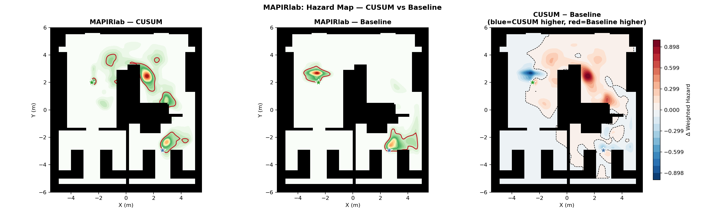
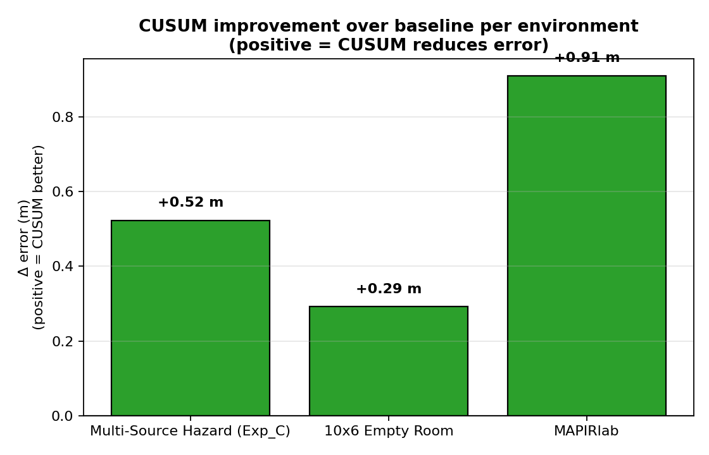
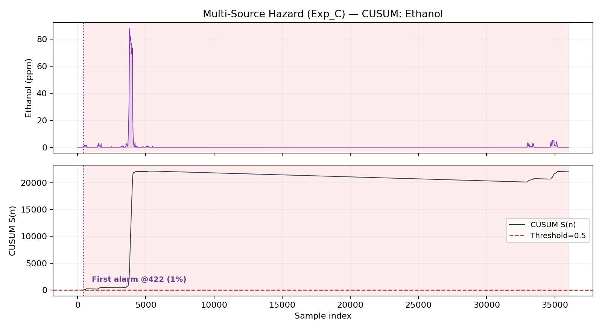
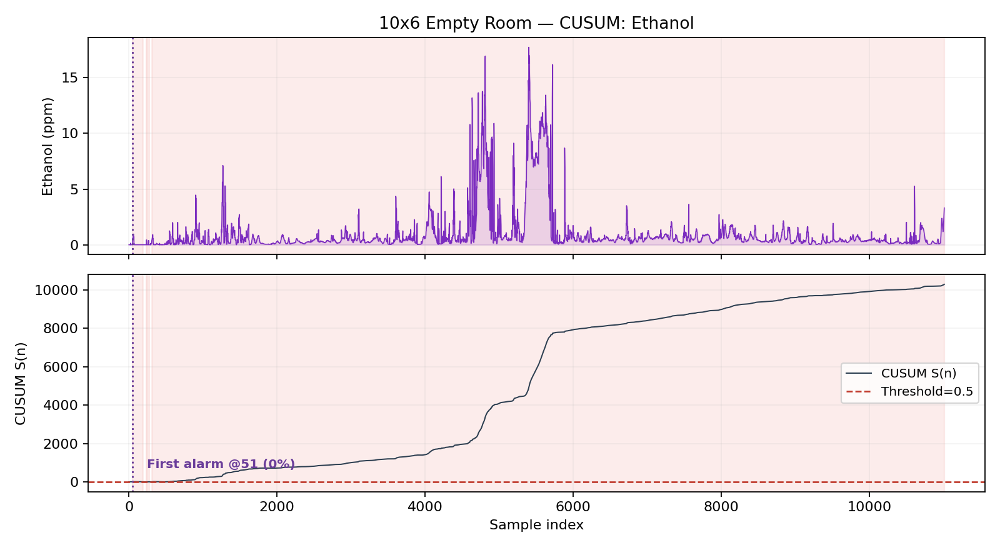
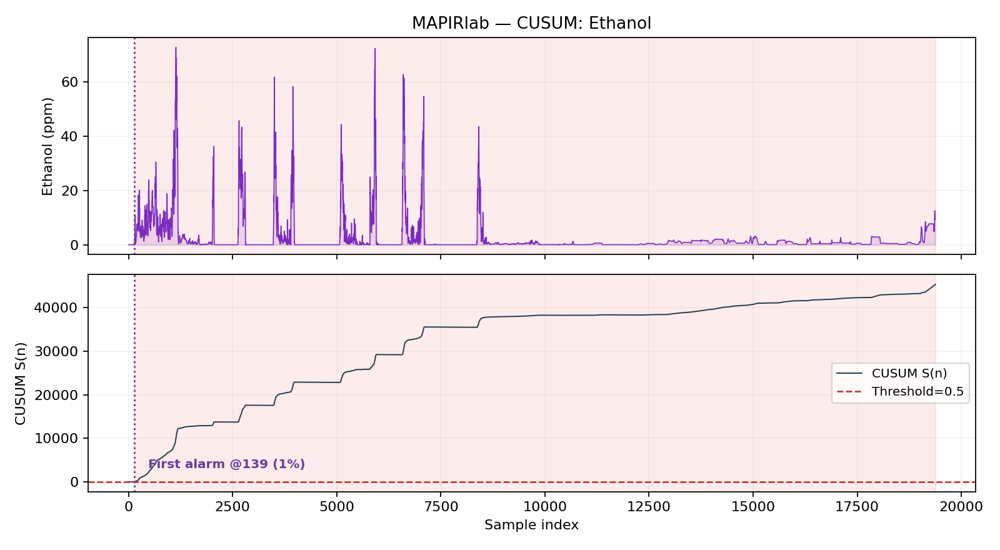

# CUSUM vs Baseline — Full Ablation Analysis

*Environments: Exp_C, 10x6 Empty Room, MAPIRlab. Maze excluded (no baseline runs).*

---

## 1. Hazard Map Comparison

Each environment shows three panels: CUSUM, Baseline and the difference (CUSUM − Baseline). Blue in the difference map = CUSUM estimates higher hazard (typically near the true source — a sharper, denser map). Red = Baseline estimates higher (gas spread more diffusely with the coarse sweep).

### Multi-Source Hazard (Exp_C)

**Hazard diff:** CUSUM > Baseline in **11.0%** of map area; Baseline > CUSUM in **4.3%**. 
CUSUM produces a **sharper, more source-centred hazard field** — the fine sweeps concentrate samples near the true sources.

### 10x6 Empty Room

**Hazard diff:** CUSUM > Baseline in **24.3%** of map area; Baseline > CUSUM in **6.1%**. 
CUSUM produces a **sharper, more source-centred hazard field** — the fine sweeps concentrate samples near the true sources.

### MAPIRlab

**Hazard diff:** CUSUM > Baseline in **12.8%** of map area; Baseline > CUSUM in **4.1%**. 
CUSUM produces a **sharper, more source-centred hazard field** — the fine sweeps concentrate samples near the true sources.

## 2. Localization Error: CUSUM vs Baseline

| Environment | Baseline err (m) | CUSUM err (m) | Δ (m) | Improvement | Verdict |
|---|---|---|---|---|---|
| Multi-Source Hazard (Exp_C) | 1.07 | 0.54 | +0.52 | 49% | ↓ CUSUM better |
| 10x6 Empty Room | 2.98 | 2.69 | +0.29 | 10% | ↓ CUSUM better |
| MAPIRlab | 1.53 | 0.62 | +0.91 | 59% | ↓ CUSUM better |

## 3. Map Coverage

- **Multi-Source Hazard (Exp_C)**: CUSUM 55.9% vs Baseline 51.2% → CUSUM +4.7% higher.
- **10x6 Empty Room**: CUSUM 75.4% vs Baseline 58.8% → CUSUM +16.6% higher.
- **MAPIRlab**: CUSUM 47.5% vs Baseline 45.9% → CUSUM +1.6% higher.

## 4. CUSUM Detection

### Multi-Source Hazard (Exp_C)

- **Ethanol**: first alarm at **1%** of mission, 1 episode(s), peak **88.0 ppm**.
- **Methane**: first alarm at **17%** of mission, 3 episode(s), peak **19.3 ppm**.
- **Hydrogen**: first alarm at **61%** of mission, 3 episode(s), peak **15.8 ppm**.
- **Propanol**: first alarm at **15%** of mission, 1 episode(s), peak **295.2 ppm**.
### 10x6 Empty Room

- **Ethanol**: first alarm at **0%** of mission, 4 episode(s), peak **17.7 ppm**.
- **Methane**: first alarm at **nan%** of mission, 0 episode(s), peak **85.8 ppm**.
### MAPIRlab

- **Ethanol**: first alarm at **1%** of mission, 1 episode(s), peak **72.8 ppm**.
- **Methane**: first alarm at **46%** of mission, 8 episode(s), peak **1.4 ppm**.

## 5. Detailed Analysis

### Why hazard maps differ

The weighted hazard map is a **sensor-measurement-driven** product. CUSUM triggers a fine local sweep the moment a hotspot is confirmed, densifying samples around the true source. This means:

1. **Near-source cells** get far more readings in the CUSUM run → the interpolated hazard field shows a **sharper, hotter peak** at the source.
2. **Remote cells** may have fewer CUSUM samples (the robot spent time in fine-sweep zones) → the diffuse background can be lower.
3. In the difference map, blue blobs clustering around the gas-source stars ★ confirm this: the CUSUM hazard map is *better targeted* to where the gas actually comes from.

### Why localization error changes

The 1/r Bayesian estimator is most accurate when it has **dense, high-ppm samples close to the source**. The CUSUM fine sweep directly provides these. Without it, the coarse sweep may visit the source region only once, leaving the posterior diffuse and susceptible to wind bias.

However, CUSUM can also **hurt** when:
- The CUSUM fires on a diffuse plume fringe (not the source), directing the fine sweep to the wrong location.
- The reactive refine interrupts the coarse sweep before the robot reaches remote gas sources, leaving one gas under-sampled.

### Coverage trade-off

CUSUM's fine sweeps add extra waypoints in confirmed hotspot areas. This typically *increases* coverage (robot explores corners it was heading toward anyway, plus the hotspot region). Occasionally coverage dips if the fine sweep burns waypoints far from the coarse frontier.

